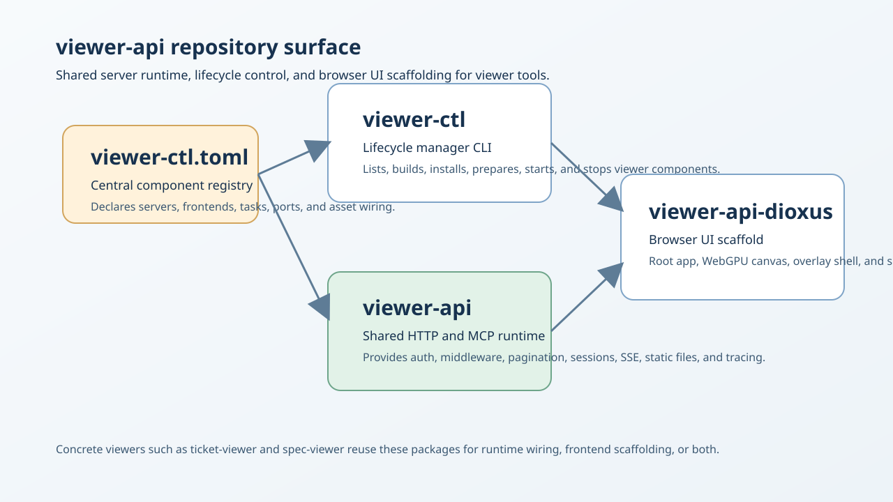

# viewer-api

viewer-api is the shared runtime repository for viewer servers, viewer lifecycle control, and browser-side UI scaffolding.

Direct child READMEs:

- [viewer-ctl/README.md](viewer-ctl/README.md)
- [viewer-api/README.md](viewer-api/README.md)
- [viewer-api/frontend/dioxus/README.md](viewer-api/frontend/dioxus/README.md)

Installable content in this repository centers on the `viewer-ctl` binary and the reusable `viewer-api` and `viewer-api-dioxus` build targets consumed by viewer servers and frontends.

## Tool Surface

| Package or surface | What it is used for | Typical entry points |
| --- | --- | --- |
| `viewer-api` | Shared HTTP and MCP runtime for viewer tools, including auth, middleware, pagination, query/session helpers, source adapters, SSE, static file serving, and tracing setup. | Rust library consumed by viewer servers |
| `viewer-ctl` | Config-driven lifecycle manager for viewer components declared in `viewer-ctl.toml`. | `viewer-ctl list`, `viewer-ctl start`, `viewer-ctl prepare` |
| `viewer-api-dioxus` | Dioxus viewer platform scaffold with the root app, WebGPU canvas, UI overlay shell, and shared frontend building blocks. | `trunk serve`, `cargo check --target wasm32-unknown-unknown -p viewer-api-dioxus` |

## Tool Screenshots

The current repository visual below summarizes the three main package surfaces in `viewer-api`.



## Dependency Graph


## Tool Use Examples

### Install the viewer toolchain

From the `context-engine` repo root, install the lifecycle manager and WASM frontend builder together:

```bash
bash ./install-tools.sh --tool viewer-ctl --tool trunk
```

If you are working from a standalone `memory-viewers/viewer-api` checkout, use Cargo directly from this workspace:

```bash
cargo install --path viewer-ctl --bin viewer-ctl
cargo install trunk
```

After that, `viewer-ctl prepare ...` can build the Dioxus frontends because the `trunk` command is on `PATH`.

- `viewer-ctl list`, `viewer-ctl start`, and `viewer-ctl prepare` are documented in [viewer-ctl/README.md](viewer-ctl/README.md).
- The shared backend runtime checked with `cargo check -p viewer-api` is documented in [viewer-api/README.md](viewer-api/README.md).
- The frontend `trunk serve` and `cargo check --target wasm32-unknown-unknown -p viewer-api-dioxus` flows are documented in [viewer-api/frontend/dioxus/README.md](viewer-api/frontend/dioxus/README.md).

```bash
viewer-ctl list
viewer-ctl start spec-viewer
cargo check -p viewer-api
cargo check --target wasm32-unknown-unknown -p viewer-api-dioxus
```

- Inspect which viewer components are declared in `viewer-ctl.toml`.
- Start a configured viewer through the lifecycle manager.
- Validate the shared backend runtime in `viewer-api`.
- Validate the shared browser scaffold in `viewer-api-dioxus`.
