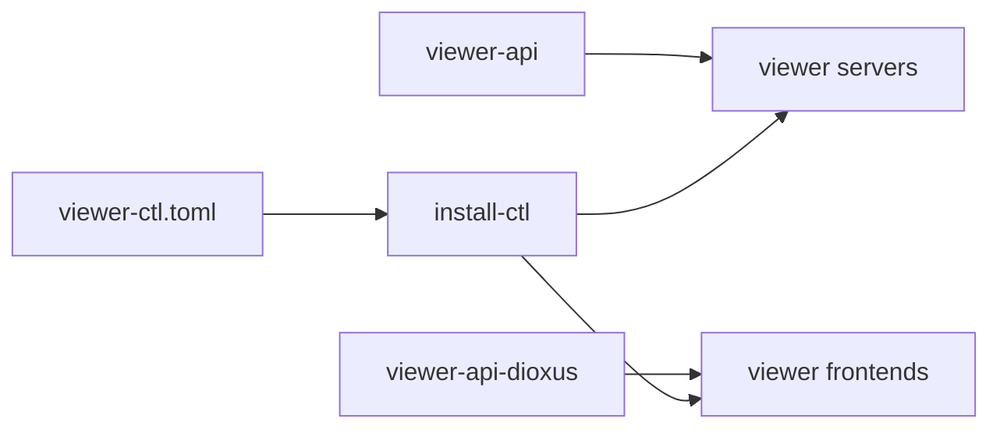

# viewer-api

viewer-api is the shared runtime repository for viewer servers, viewer lifecycle control, and browser-side UI scaffolding.

Direct child READMEs:

- [viewer-api/README.md](viewer-api/README.md)
- [viewer-api/frontend/dioxus/README.md](viewer-api/frontend/dioxus/README.md)

Viewer lifecycle control now lives outside this submodule: `install-ctl` in the main `context-engine` repo at `tools/install/install-ctl/` absorbed the former `viewer-ctl` binary's full surface (`install-ctl viewer <list|status|build|install|start|stop|restart|task|prepare|static-dir>`, plus top-level `install-ctl start <server>` / `install-ctl prepare <server>` aliases). Installable content in this repository now centers on the reusable `viewer-api` and `viewer-api-dioxus` build targets consumed by viewer servers and frontends.

## Tool Surface

| Package or surface | What it is used for | Typical entry points |
| --- | --- | --- |
| `viewer-api` | Shared HTTP and MCP runtime for viewer tools, including auth, middleware, pagination, query/session helpers, source adapters, SSE, static file serving, and tracing setup. | Rust library consumed by viewer servers |
| `viewer-api-dioxus` | Dioxus viewer platform scaffold with the root app, WebGPU canvas, UI overlay shell, and shared frontend building blocks. | `trunk serve`, `cargo check --target wasm32-unknown-unknown -p viewer-api-dioxus` |

## Tool Screenshots

The current repository visual below summarizes the three main package surfaces in `viewer-api`.


## Dependency Graph



## Tool Use Examples

### Install the viewer toolchain

From the `context-engine` repo root, build `install-ctl` and the WASM frontend builder together:

```bash
cargo build -p install-ctl
cargo install trunk
```

After that, `install-ctl viewer prepare ...` can build the Dioxus frontends because the `trunk` command is on `PATH`.

- `install-ctl viewer list`, `install-ctl start`, and `install-ctl prepare` are documented in the main repo's [tools/install/install-ctl/](../../tools/install/install-ctl/) README.
- The shared backend runtime checked with `cargo check -p viewer-api` is documented in [viewer-api/README.md](viewer-api/README.md).
- The frontend `trunk serve` and `cargo check --target wasm32-unknown-unknown -p viewer-api-dioxus` flows are documented in [viewer-api/frontend/dioxus/README.md](viewer-api/frontend/dioxus/README.md).

```bash
install-ctl viewer list
install-ctl start spec-viewer
cargo check -p viewer-api
cargo check --target wasm32-unknown-unknown -p viewer-api-dioxus
```

- Inspect which viewer components are declared in `viewer-ctl.toml` (main repo root).
- Start a configured viewer through `install-ctl`.
- Validate the shared backend runtime in `viewer-api`.
- Validate the shared browser scaffold in `viewer-api-dioxus`.
